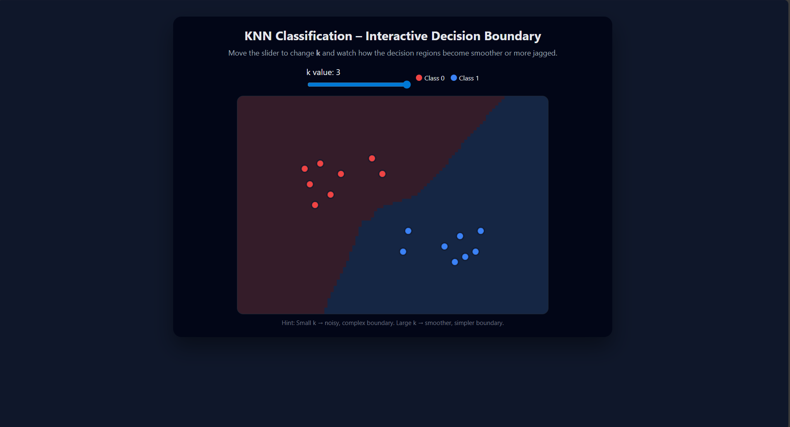

---

## ▶️ How to Run

1. Download/clone the repository
2. Open `index.html` in any modern browser (Chrome/Firefox/Edge)
3. Play with the slider and click to add points 🎨

---

## 📸 Screenshot

Here is the interface preview:

---

## 🤝 Contributing

Feel free to fork and improve:
- Add more classes 🎯
- Add dataset import 📥
- Add animation 🎞️
- Switch to real KNN library for scalability ⚙️

Pull requests are welcome!

---

## 📜 License

MIT License — free to use and modify.

---

Made with ❤️ to visualize machine learning.
